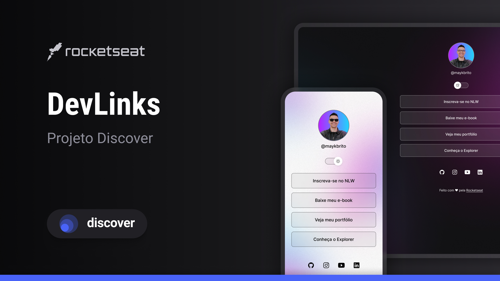

<h1 align="center"> DevLinks </h1>

Rocketseat promotes an exclusive, free program for teaching technology. WEB

  

 

  

## 🚀 Technologies

This project has been developed using the following technologies:

- HTML e CSS
- JavaScript
- Git e Github
- Figma

## 💻 Project

The DevLinks Project is a link aggregator that works on any device and can be used as a virtual business card on social networks.

<!--START_SECTION:footer-->

#
